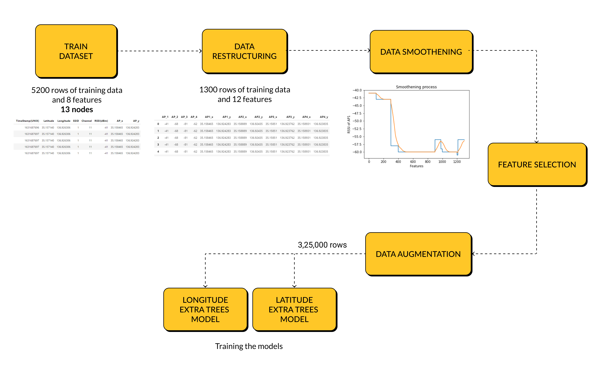
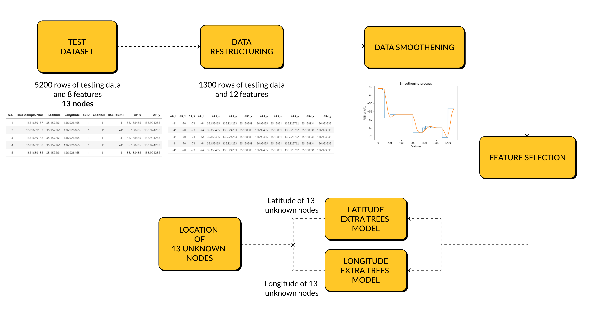

# SSN_ITU-ML5G-PS-016
 

**Team Name:**  
SSN_ITU  

**Problem Statement** 
ITU-ML5G-PS-016.1 Location Estimation using RSSI of Wireless LAN 
 

**Team Members:**
 
Charu Jain  
Indu Subramanian 
Meghna Govind 
N Venkateswaran 

The proposed solution is as follows: 

# Training 

# Testing

